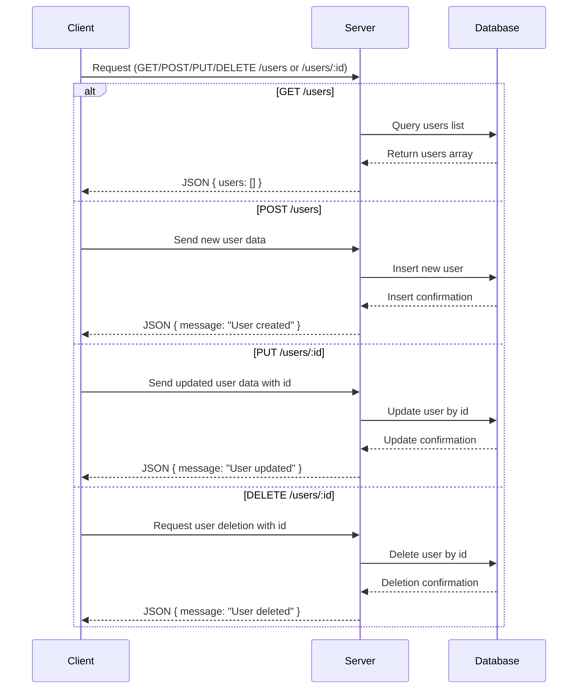

Based on the provided backend source code, here is the extracted API information:

---

### A) API Endpoint List

| Endpoint        | HTTP Method | Path Parameters | Query Parameters | Request Body | Response                      | Status Codes | Authentication |
|-----------------|-------------|-----------------|------------------|--------------|-------------------------------|--------------|----------------|
| `/users`        | GET         | None            | None             | None         | `{ users: Array }`             | 200          | No             |
| `/users`        | POST        | None            | None             | Not explicitly defined, but expected | `{ message: "User created" }`   | 200          | No             |
| `/users/:id`    | PUT         | `id`            | None             | Not explicitly defined, but expected | `{ message: "User updated" }`   | 200          | No             |
| `/users/:id`    | DELETE      | `id`            | None             | None         | `{ message: "User deleted" }`  | 200          | No             |

---

### B) Short Developer Documentation

**1. GET /users**

- Retrieves a list of users.
- No parameters required.
- Returns a JSON object containing an array of users.
- Example response: `{ "users": [] }`
- Status: 200 OK

---

**2. POST /users**

- Creates a new user.
- Request body expected but not specified in code.
- Returns a JSON message confirming creation.
- Example response: `{ "message": "User created" }`
- Status: 200 OK

---

**3. PUT /users/:id**

- Updates an existing user by ID.
- Path parameter: `id` (User identifier)
- Request body expected but not specified in code.
- Returns a JSON message confirming update.
- Example response: `{ "message": "User updated" }`
- Status: 200 OK

---

**4. DELETE /users/:id**

- Deletes a user by ID.
- Path parameter: `id` (User identifier)
- Returns a JSON message confirming deletion.
- Example response: `{ "message": "User deleted" }`
- Status: 200 OK

---

### C) OpenAPI 3.0 YAML Specification

```yaml
openapi: 3.0.3
info:
  title: User Management API
  version: 1.0.0
paths:
  /users:
    get:
      summary: Get list of users
      responses:
        '200':
          description: A list of users
          content:
            application/json:
              schema:
                type: object
                properties:
                  users:
                    type: array
                    items:
                      type: object
                    description: List of user objects
    post:
      summary: Create a new user
      requestBody:
        description: User object to create (schema not specified)
        required: true
        content:
          application/json:
            schema:
              type: object
      responses:
        '200':
          description: User created successfully
          content:
            application/json:
              schema:
                type: object
                properties:
                  message:
                    type: string
                    example: User created
  /users/{id}:
    put:
      summary: Update an existing user
      parameters:
        - in: path
          name: id
          required: true
          schema:
            type: string
          description: User ID
      requestBody:
        description: User object with updated fields (schema not specified)
        required: true
        content:
          application/json:
            schema:
              type: object
      responses:
        '200':
          description: User updated successfully
          content:
            application/json:
              schema:
                type: object
                properties:
                  message:
                    type: string
                    example: User updated
    delete:
      summary: Delete a user
      parameters:
        - in: path
          name: id
          required: true
          schema:
            type: string
          description: User ID
      responses:
        '200':
          description: User deleted successfully
          content:
            application/json:
              schema:
                type: object
                properties:
                  message:
                    type: string
                    example: User deleted
components: {}
```

---

### D) Example Request and Response

**GET /users**

Request:

```http
GET /users HTTP/1.1
Host: example.com
```

Response:

```json
{
  "users": []
}
```

---

**POST /users**

Request:

```http
POST /users HTTP/1.1
Host: example.com
Content-Type: application/json

{
  "name": "John Doe",
  "email": "john@example.com"
}
```

Response:

```json
{
  "message": "User created"
}
```

---

**PUT /users/123**

Request:

```http
PUT /users/123 HTTP/1.1
Host: example.com
Content-Type: application/json

{
  "email": "john.doe@example.com"
}
```

Response:

```json
{
  "message": "User updated"
}
```

---

**DELETE /users/123**

Request:

```http
DELETE /users/123 HTTP/1.1
Host: example.com
```

Response:

```json
{
  "message": "User deleted"
}
```

---

### Mermaid Sequence Diagram



---

If you need more details or further assistance, just ask!