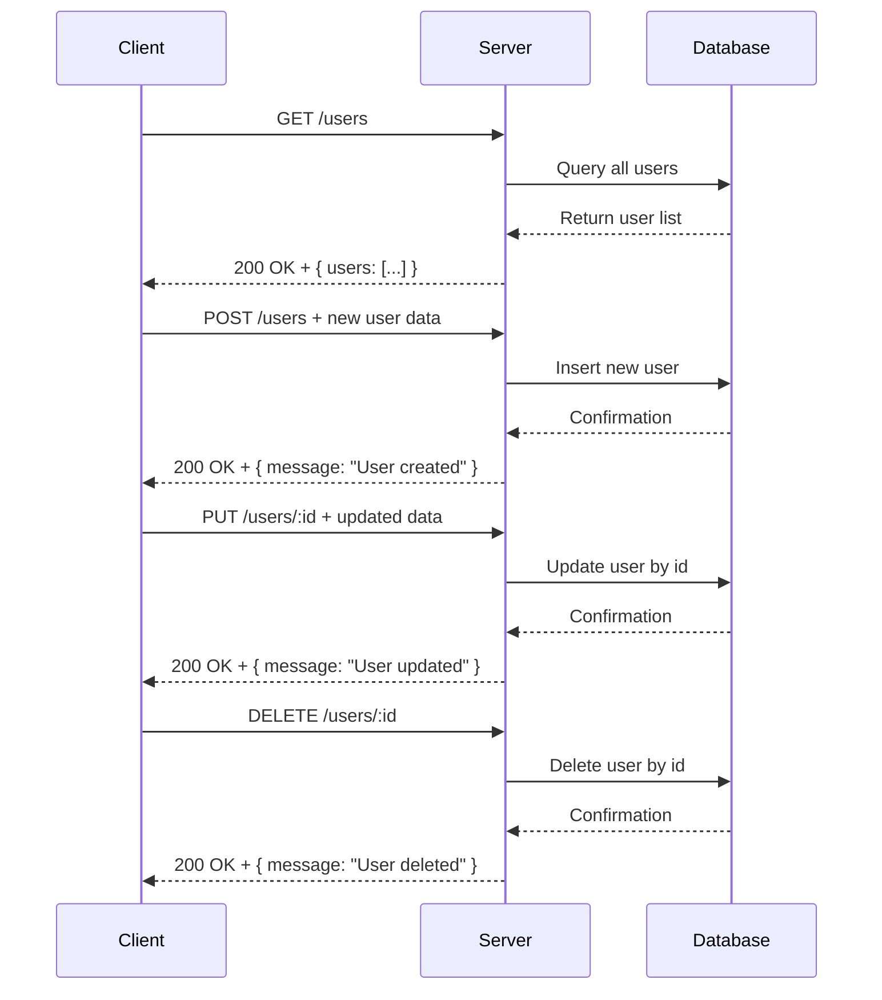

Here is the extracted API information and documentation based on the provided Node.js Express backend source code.

---

## A) Clean API Endpoint List

| HTTP Method | Endpoint         | Description       | Path Parameters | Query Parameters | Request Body | Authentication |
|-------------|------------------|-------------------|-----------------|------------------|--------------|----------------|
| GET         | /users           | Fetch user list   | None            | None             | None         | None           |
| POST        | /users           | Create a new user | None            | None             | None shown   | None           |
| PUT         | /users/:id       | Update user by ID | id (string)     | None             | None shown   | None           |
| DELETE      | /users/:id       | Delete user by ID | id (string)     | None             | None         | None           |

---

## B) Short Developer Documentation

### 1. GET /users
Fetches a list of users.

- **Request**: No parameters, no body.
- **Response**: JSON object containing `users` array (empty in current implementation).
- **Status codes**: 200 OK
- **Authentication**: None required.

### 2. POST /users
Creates a new user.

- **Request**: No schema shown (likely expects JSON body with user details).
- **Response**: JSON containing a message: `"User created"`.
- **Status codes**: 200 OK.
- **Authentication**: None required.

### 3. PUT /users/:id
Updates the user identified by the `id` URL parameter.

- **Path Parameters**:
  - `id`: User identifier.
- **Request**: No schema shown (likely JSON body with fields to update).
- **Response**: JSON containing a message: `"User updated"`.
- **Status codes**: 200 OK.
- **Authentication**: None required.

### 4. DELETE /users/:id
Deletes the user identified by the `id` URL parameter.

- **Path Parameters**:
  - `id`: User identifier.
- **Response**: JSON containing a message: `"User deleted"`.
- **Status codes**: 200 OK.
- **Authentication**: None required.

---

## C) OpenAPI 3.0 YAML Specification

```yaml
openapi: 3.0.3
info:
  title: User API
  version: 1.0.0
paths:
  /users:
    get:
      summary: Get list of users
      responses:
        '200':
          description: A list of users
          content:
            application/json:
              schema:
                type: object
                properties:
                  users:
                    type: array
                    items:
                      type: object
                    example: []
    post:
      summary: Create a new user
      requestBody:
        description: User data (not defined in source)
        required: false
        content:
          application/json:
            schema:
              type: object
      responses:
        '200':
          description: User created successfully
          content:
            application/json:
              schema:
                type: object
                properties:
                  message:
                    type: string
                    example: User created
  /users/{id}:
    put:
      summary: Update an existing user
      parameters:
        - name: id
          in: path
          required: true
          schema:
            type: string
          description: User ID
      requestBody:
        description: Fields to update (not defined)
        required: false
        content:
          application/json:
            schema:
              type: object
      responses:
        '200':
          description: User updated successfully
          content:
            application/json:
              schema:
                type: object
                properties:
                  message:
                    type: string
                    example: User updated
    delete:
      summary: Delete a user
      parameters:
        - name: id
          in: path
          required: true
          schema:
            type: string
          description: User ID
      responses:
        '200':
          description: User deleted successfully
          content:
            application/json:
              schema:
                type: object
                properties:
                  message:
                    type: string
                    example: User deleted
```

---

## D) Example Request and Response

### GET /users

**Request**

```
GET /users HTTP/1.1
Host: example.com
```

**Response**

```json
{
  "users": []
}
```

---

### POST /users

**Request**

```
POST /users HTTP/1.1
Host: example.com
Content-Type: application/json

{
  "name": "John Doe",
  "email": "john@example.com"
}
```

**Response**

```json
{
  "message": "User created"
}
```

---

### PUT /users/123

**Request**

```
PUT /users/123 HTTP/1.1
Host: example.com
Content-Type: application/json

{
  "email": "newemail@example.com"
}
```

**Response**

```json
{
  "message": "User updated"
}
```

---

### DELETE /users/123

**Request**

```
DELETE /users/123 HTTP/1.1
Host: example.com
```

**Response**

```json
{
  "message": "User deleted"
}
```

---

## Mermaid Sequence Diagram



---

If you need further details or additions, please let me know!