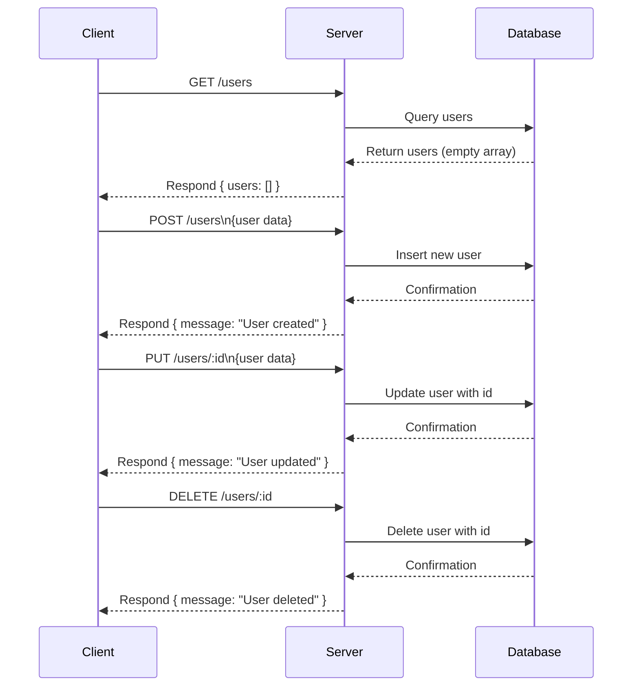

### Analysis of provided backend source code

The code is a basic Express.js app defining four API endpoints related to users.

---

## A) Clean API endpoint list

| HTTP Method | Path         | Description           | Path Parameters | Query Parameters | Request Body   | Response                   | Status Codes | Authentication |
|-------------|--------------|----------------------|-----------------|------------------|----------------|----------------------------|--------------|----------------|
| GET         | /users       | Get list of users    | None            | None             | None           | `{ users: Array }`          | 200          | None           |
| POST        | /users       | Create a new user    | None            | None             | Not defined    | `{ message: "User created" }` | 200       | None           |
| PUT         | /users/:id   | Update a user        | `id`            | None             | Not defined    | `{ message: "User updated" }` | 200       | None           |
| DELETE      | /users/:id   | Delete a user        | `id`            | None             | None           | `{ message: "User deleted" }` | 200       | None           |

---

## B) Short developer documentation

### 1. GET /users  
Fetches a list of users. Returns an empty array as per current implementation.

- **Response**: JSON object with key `users` containing an array.
- **Status**: 200 OK
- **Authentication**: None required.

---

### 2. POST /users  
Creates a new user (no request body schema defined currently). Returns a confirmation message.

- **Request body**: Not defined in the code.
- **Response**: JSON with message `User created`.
- **Status**: 200 OK
- **Authentication**: None required.

---

### 3. PUT /users/:id  
Updates user info for the provided user ID (no request body schema defined).  

- **Path parameter**:
  - `id` (string): User identifier
- **Request body**: Not defined.
- **Response**: JSON with message `User updated`.
- **Status**: 200 OK
- **Authentication**: None required.

---

### 4. DELETE /users/:id  
Deletes a user by ID.

- **Path parameter**: 
  - `id` (string): User identifier  
- **Response**: JSON with message `User deleted`.
- **Status**: 200 OK
- **Authentication**: None required.

---

## C) OpenAPI 3.0 YAML specification

```yaml
openapi: 3.0.3
info:
  title: User API
  version: 1.0.0
paths:
  /users:
    get:
      summary: Get list of users
      responses:
        '200':
          description: List of users
          content:
            application/json:
              schema:
                type: object
                properties:
                  users:
                    type: array
                    items: {}
    post:
      summary: Create a new user
      requestBody:
        description: User data (not defined in code)
        content:
          application/json:
            schema:
              type: object
      responses:
        '200':
          description: Confirmation message
          content:
            application/json:
              schema:
                type: object
                properties:
                  message:
                    type: string
                    example: User created
  /users/{id}:
    put:
      summary: Update a user
      parameters:
        - in: path
          name: id
          schema:
            type: string
          required: true
          description: User ID
      requestBody:
        description: Updated user data (not defined)
        content:
          application/json:
            schema:
              type: object
      responses:
        '200':
          description: Confirmation message
          content:
            application/json:
              schema:
                type: object
                properties:
                  message:
                    type: string
                    example: User updated
    delete:
      summary: Delete a user
      parameters:
        - in: path
          name: id
          schema:
            type: string
          required: true
          description: User ID
      responses:
        '200':
          description: Confirmation message
          content:
            application/json:
              schema:
                type: object
                properties:
                  message:
                    type: string
                    example: User deleted
```

---

## D) Example request and response

### Example 1: GET /users

**Request:**  
```
GET /users
```

**Response:**  
```json
{
  "users": []
}
```

---

### Example 2: POST /users

**Request:**  
```
POST /users
Content-Type: application/json

{
  "name": "John Doe"
}
```

**Response:**  
```json
{
  "message": "User created"
}
```

---

### Example 3: PUT /users/123

**Request:**  
```
PUT /users/123
Content-Type: application/json

{
  "name": "John Smith"
}
```

**Response:**  
```json
{
  "message": "User updated"
}
```

---

### Example 4: DELETE /users/123

**Request:**  
```
DELETE /users/123
```

**Response:**  
```json
{
  "message": "User deleted"
}
```

---

## Mermaid sequence diagram



---

**Note:** Authentication is not implemented in the code. Also, request bodies for POST and PUT endpoints are not explicitly validated or defined.