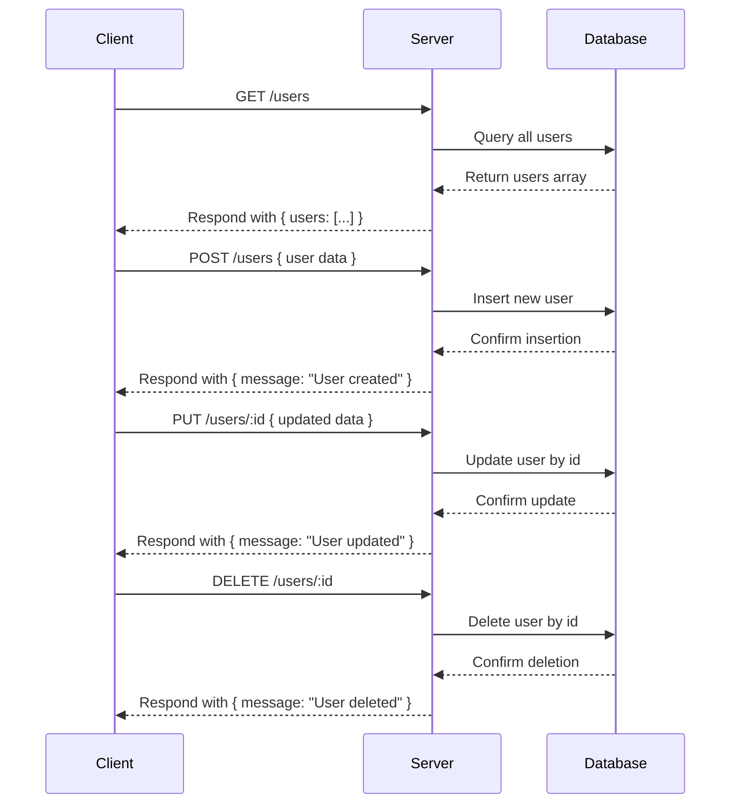

### Analysis of the provided backend source code:

1. **API endpoints:**
   - `GET /users`
   - `POST /users`
   - `PUT /users/:id`
   - `DELETE /users/:id`

2. **HTTP methods:**
   - GET, POST, PUT, DELETE

3. **Path parameters:**
   - `id` in `/users/:id` for PUT and DELETE

4. **Query parameters:**
   - None defined or used

5. **Request body schema:**
   - Not explicitly defined, but POST and PUT likely expect JSON body (user data). No validation or schema given.

6. **Response structure:**
   - GET /users: `{ users: [] }` (list of users, empty array here)
   - POST /users: `{ message: "User created" }`
   - PUT /users/:id: `{ message: "User updated" }`
   - DELETE /users/:id: `{ message: "User deleted" }`

7. **Status codes:**
   - Default 200 OK (express's res.json defaults to 200)

8. **Authentication requirements:**
   - None present in the source code.

---

## A) Clean API endpoint list

| Method | Endpoint       | Description          | Path Params | Query Params | Request Body | Response                  |
|--------|----------------|----------------------|-------------|--------------|--------------|---------------------------|
| GET    | /users         | Fetch all users      | None        | None         | None         | `{ users: User[] }`        |
| POST   | /users         | Create a new user    | None        | None         | User data?   | `{ message: "User created" }` |
| PUT    | /users/:id     | Update user by ID    | id          | None         | User data?   | `{ message: "User updated" }` |
| DELETE | /users/:id     | Delete user by ID    | id          | None         | None         | `{ message: "User deleted" }` |

---

## B) Short developer documentation

### GET /users
- Retrieves a list of all users.
- Response: JSON object with a `users` array.
- Status: 200 OK

### POST /users
- Creates a new user.
- Expected Body: JSON with user details (not explicitly defined).
- Response: JSON message confirming creation.
- Status: 200 OK

### PUT /users/:id
- Updates an existing user identified by `id`.
- Path Parameter: `id` (string or number of the user).
- Expected Body: JSON with updated user details (not explicitly defined).
- Response: JSON message confirming update.
- Status: 200 OK

### DELETE /users/:id
- Deletes a user identified by `id`.
- Path Parameter: `id` (string or number of the user).
- Response: JSON message confirming deletion.
- Status: 200 OK

### Authentication
- No authentication or authorization implemented.

---

## C) OpenAPI 3.0 YAML specification

```yaml
openapi: 3.0.3
info:
  title: User Management API
  version: 1.0.0
paths:
  /users:
    get:
      summary: Get all users
      responses:
        '200':
          description: List of users
          content:
            application/json:
              schema:
                type: object
                properties:
                  users:
                    type: array
                    items:
                      type: object
                      description: User object (empty here, no fields defined)
    post:
      summary: Create a new user
      requestBody:
        description: User data to create
        required: true
        content:
          application/json:
            schema:
              type: object
              description: User data (schema not defined)
      responses:
        '200':
          description: User created confirmation
          content:
            application/json:
              schema:
                type: object
                properties:
                  message:
                    type: string
                    example: User created
  /users/{id}:
    put:
      summary: Update existing user
      parameters:
        - in: path
          name: id
          schema:
            type: string
          required: true
          description: User ID
      requestBody:
        description: User data to update
        required: true
        content:
          application/json:
            schema:
              type: object
              description: User data (schema not defined)
      responses:
        '200':
          description: User updated confirmation
          content:
            application/json:
              schema:
                type: object
                properties:
                  message:
                    type: string
                    example: User updated
    delete:
      summary: Delete user by ID
      parameters:
        - in: path
          name: id
          schema:
            type: string
          required: true
          description: User ID
      responses:
        '200':
          description: User deleted confirmation
          content:
            application/json:
              schema:
                type: object
                properties:
                  message:
                    type: string
                    example: User deleted
components: {}
```

---

## D) Example request and response

### Example: GET /users

**Request**

```http
GET /users HTTP/1.1
Host: example.com
```

**Response**

```json
{
  "users": []
}
```

---

### Example: POST /users

**Request**

```http
POST /users HTTP/1.1
Host: example.com
Content-Type: application/json

{
  "name": "John Doe",
  "email": "john@example.com"
}
```

**Response**

```json
{
  "message": "User created"
}
```

---

### Example: PUT /users/123

**Request**

```http
PUT /users/123 HTTP/1.1
Host: example.com
Content-Type: application/json

{
  "name": "John Doe Updated"
}
```

**Response**

```json
{
  "message": "User updated"
}
```

---

### Example: DELETE /users/123

**Request**

```http
DELETE /users/123 HTTP/1.1
Host: example.com
```

**Response**

```json
{
  "message": "User deleted"
}
```

---

## Mermaid sequence diagram

