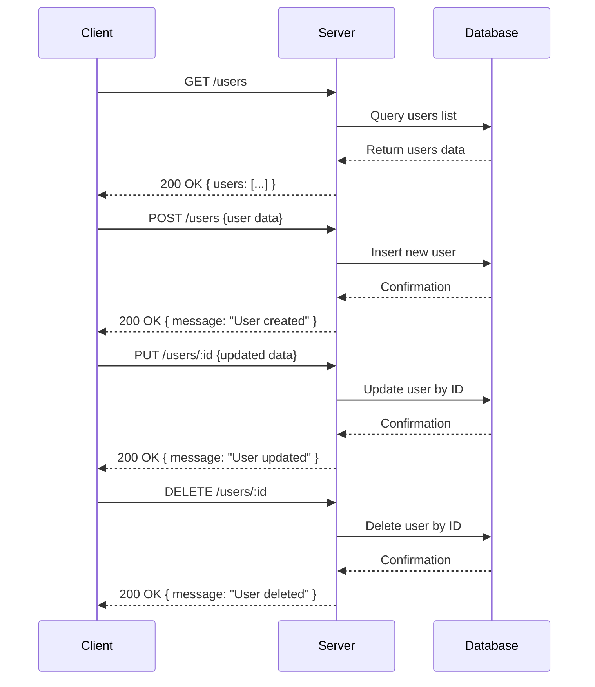

### Analysis of the provided backend source code

**1. API Endpoints:**
- `GET /users`
- `POST /users`
- `PUT /users/:id`
- `DELETE /users/:id`

**2. HTTP Methods:**
- GET
- POST
- PUT
- DELETE

**3. Path Parameters:**
- `id` (for `PUT /users/:id` and `DELETE /users/:id`)

**4. Query Parameters:**
- None used in the code.

**5. Request Body Schema:**
- Not explicitly defined in the code (no body parsing or validation).
- For `POST /users` and `PUT /users/:id`, request bodies are implied (likely JSON user data) but not specified.

**6. Response Structure:**
- `GET /users` returns JSON: `{ users: [] }` (an empty array of users)
- `POST /users` returns JSON: `{ message: "User created" }`
- `PUT /users/:id` returns JSON: `{ message: "User updated" }`
- `DELETE /users/:id` returns JSON: `{ message: "User deleted" }`

**7. Status Codes:**
- The code implicitly responds with status 200 OK in all cases.

**8. Authentication requirements:**
- No authentication middleware or headers checked, so none required.

---

## A) Clean API Endpoint List

| Method | Endpoint       | Path Params | Description          |
|--------|----------------|-------------|----------------------|
| GET    | /users         | None        | Get list of users    |
| POST   | /users         | None        | Create new user      |
| PUT    | /users/:id     | id          | Update user by id    |
| DELETE | /users/:id     | id          | Delete user by id    |

---

## B) Short Developer Documentation

### GET /users

Retrieves a list of users.  
**Response:** 200 OK  
```json
{
  "users": []
}
```

---

### POST /users

Creates a new user.  
**Request body:** JSON user data (not explicitly defined)  
**Response:** 200 OK  
```json
{
  "message": "User created"
}
```

---

### PUT /users/:id

Updates an existing user by their ID.  
**Path parameters:**  
- `id` (string) - User identifier  
**Request body:** JSON user data (not explicitly defined)  
**Response:** 200 OK  
```json
{
  "message": "User updated"
}
```

---

### DELETE /users/:id

Deletes a user by their ID.  
**Path parameters:**  
- `id` (string) - User identifier  
**Response:** 200 OK  
```json
{
  "message": "User deleted"
}
```

---

## C) OpenAPI 3.0 YAML Specification

```yaml
openapi: 3.0.3
info:
  title: User Management API
  version: "1.0.0"
paths:
  /users:
    get:
      summary: Get list of users
      responses:
        '200':
          description: A JSON array of users
          content:
            application/json:
              schema:
                type: object
                properties:
                  users:
                    type: array
                    items:
                      type: object
                      description: User object
    post:
      summary: Create a new user
      requestBody:
        description: User data (not explicitly defined)
        required: true
        content:
          application/json:
            schema:
              type: object
              description: User object (schema not specified)
      responses:
        '200':
          description: User created message
          content:
            application/json:
              schema:
                type: object
                properties:
                  message:
                    type: string
                    example: User created
  /users/{id}:
    put:
      summary: Update a user by ID
      parameters:
        - in: path
          name: id
          required: true
          schema:
            type: string
          description: User ID
      requestBody:
        description: User data to update (not explicitly defined)
        required: true
        content:
          application/json:
            schema:
              type: object
              description: User object (schema not specified)
      responses:
        '200':
          description: User updated message
          content:
            application/json:
              schema:
                type: object
                properties:
                  message:
                    type: string
                    example: User updated
    delete:
      summary: Delete a user by ID
      parameters:
        - in: path
          name: id
          required: true
          schema:
            type: string
          description: User ID
      responses:
        '200':
          description: User deleted message
          content:
            application/json:
              schema:
                type: object
                properties:
                  message:
                    type: string
                    example: User deleted
components: {}
```

---

## D) Example Request and Response

**Example 1: GET /users**

Request:

```
GET /users HTTP/1.1
Host: example.com
```

Response:

```json
{
  "users": []
}
```

---

**Example 2: POST /users**

Request:

```
POST /users HTTP/1.1
Host: example.com
Content-Type: application/json

{
  "username": "johndoe",
  "email": "john@example.com"
}
```

Response:

```json
{
  "message": "User created"
}
```

---

**Example 3: PUT /users/123**

Request:

```
PUT /users/123 HTTP/1.1
Host: example.com
Content-Type: application/json

{
  "email": "john.new@example.com"
}
```

Response:

```json
{
  "message": "User updated"
}
```

---

**Example 4: DELETE /users/123**

Request:

```
DELETE /users/123 HTTP/1.1
Host: example.com
```

Response:

```json
{
  "message": "User deleted"
}
```

---

## Mermaid Sequence Diagram



---

**Summary:** The provided code snippet outlines a simple CRUD REST API for "users" with no authentication, returning JSON responses for each action, using standard HTTP methods.