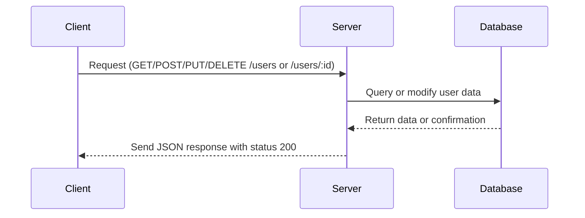

### Analysis:

The provided code is an Express.js backend implementation containing several REST API endpoints for a user resource.

---

## A) Clean API Endpoint List

| Method | Endpoint      | Path Parameters | Query Parameters | Body                          | Response                             | Status Codes | Auth |
|--------|---------------|-----------------|------------------|-------------------------------|------------------------------------|--------------|------|
| GET    | /users        | None            | None             | None                          | `{ users: Array }`                  | 200          | No   |
| POST   | /users        | None            | None             | Not explicitly shown, implicit | `{ message: "User created" }`      | 200          | No   |
| PUT    | /users/:id    | id (string)     | None             | Not explicitly shown, implicit | `{ message: "User updated" }`      | 200          | No   |
| DELETE | /users/:id    | id (string)     | None             | None                          | `{ message: "User deleted" }`      | 200          | No   |

---

## B) Short Developer Documentation

### 1. GET /users

- **Description**: Retrieves a list of users.
- **Path Parameters**: None
- **Query Parameters**: None
- **Request Body**: None
- **Response**: JSON object containing an array of users.
- **Status Codes**: 200 OK
- **Authentication**: Not required

### 2. POST /users

- **Description**: Creates a new user.
- **Path Parameters**: None
- **Query Parameters**: None
- **Request Body**: Expected user data (not defined in code).
- **Response**: Message confirming user creation.
- **Status Codes**: 200 OK
- **Authentication**: Not required

### 3. PUT /users/:id

- **Description**: Updates an existing user by ID.
- **Path Parameters**:
  - `id` (string): The user's unique identifier.
- **Query Parameters**: None
- **Request Body**: Expected updated user data (not defined in code).
- **Response**: Message confirming user update.
- **Status Codes**: 200 OK
- **Authentication**: Not required

### 4. DELETE /users/:id

- **Description**: Deletes a user by ID.
- **Path Parameters**:
  - `id` (string): The user's unique identifier.
- **Query Parameters**: None
- **Request Body**: None
- **Response**: Message confirming user deletion.
- **Status Codes**: 200 OK
- **Authentication**: Not required

---

## C) OpenAPI 3.0 YAML Specification

```yaml
openapi: 3.0.3
info:
  title: User Management API
  version: 1.0.0
  description: API for managing users
paths:
  /users:
    get:
      summary: Get all users
      responses:
        '200':
          description: List of users
          content:
            application/json:
              schema:
                type: object
                properties:
                  users:
                    type: array
                    items:
                      type: object
                      description: User object (undefined fields)
      tags:
        - Users

    post:
      summary: Create a new user
      requestBody:
        description: User object that needs to be created (schema undefined)
        required: true
        content:
          application/json:
            schema:
              type: object
      responses:
        '200':
          description: User created successfully
          content:
            application/json:
              schema:
                type: object
                properties:
                  message:
                    type: string
                    example: User created
      tags:
        - Users

  /users/{id}:
    put:
      summary: Update a user by ID
      parameters:
        - name: id
          in: path
          required: true
          schema:
            type: string
          description: User ID to update
      requestBody:
        description: User update object (schema undefined)
        required: true
        content:
          application/json:
            schema:
              type: object
      responses:
        '200':
          description: User updated successfully
          content:
            application/json:
              schema:
                type: object
                properties:
                  message:
                    type: string
                    example: User updated
      tags:
        - Users

    delete:
      summary: Delete a user by ID
      parameters:
        - name: id
          in: path
          required: true
          schema:
            type: string
          description: User ID to delete
      responses:
        '200':
          description: User deleted successfully
          content:
            application/json:
              schema:
                type: object
                properties:
                  message:
                    type: string
                    example: User deleted
      tags:
        - Users
```

---

## D) Example Request and Response

### GET /users

**Request:**

```http
GET /users HTTP/1.1
Host: example.com
```

**Response:**

```json
{
  "users": []
}
```

---

### POST /users

**Request:**

```http
POST /users HTTP/1.1
Host: example.com
Content-Type: application/json

{
  "name": "Alice",
  "email": "alice@example.com"
}
```

**Response:**

```json
{
  "message": "User created"
}
```

---

### PUT /users/123

**Request:**

```http
PUT /users/123 HTTP/1.1
Host: example.com
Content-Type: application/json

{
  "name": "Alice Smith",
  "email": "alice.smith@example.com"
}
```

**Response:**

```json
{
  "message": "User updated"
}
```

---

### DELETE /users/123

**Request:**

```http
DELETE /users/123 HTTP/1.1
Host: example.com
```

**Response:**

```json
{
  "message": "User deleted"
}
```

---

## Mermaid Sequence Diagram



---

If you need additional details or want to enrich the schema for request bodies or responses, please provide more backend logic or data model definitions.