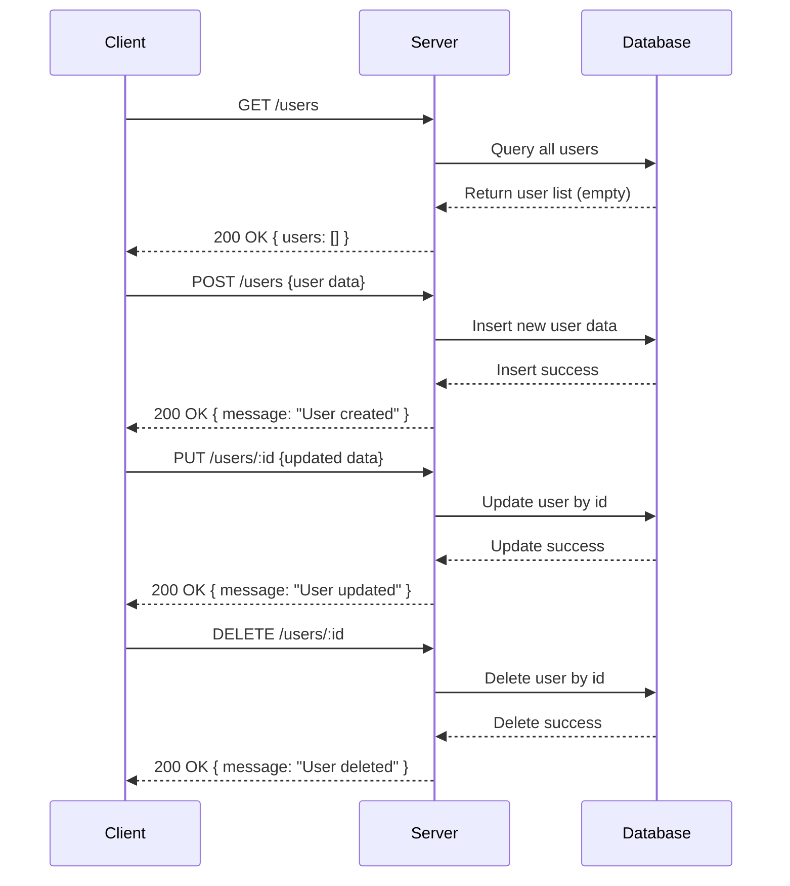

### Analysis of provided backend source code:

---

#### 1. API Endpoints & HTTP Methods:

| Endpoint        | HTTP Method | Path Parameters | Query Parameters | Request Body     | Response                  | Status Codes        | Authentication     |
|-----------------|-------------|-----------------|------------------|------------------|---------------------------|---------------------|--------------------|
| /users          | GET         | None            | None             | None             | `{ users: [] }`            | 200                 | No                 |
| /users          | POST        | None            | None             | (assumed) user data | `{ message: "User created" }` | 200 (default)       | No                 |
| /users/:id      | PUT         | id              | None             | (assumed) user update data | `{ message: "User updated" }`  | 200 (default)       | No                 |
| /users/:id      | DELETE      | id              | None             | None             | `{ message: "User deleted" }`  | 200 (default)       | No                 |

---

#### 2. Observations:

- No explicit status codes returned other than default 200.
- No authentication middleware or headers detected.
- Request body schemas are not defined explicitly in the code.
- The response structures are simple JSON objects with either a users array or message string.
- Path params (id) exist for PUT and DELETE methods.

---

## A) Clean API Endpoint List

| Method | Endpoint     | Description          |
|--------|--------------|----------------------|
| GET    | /users       | Retrieve list of users |
| POST   | /users       | Create a new user     |
| PUT    | /users/:id   | Update an existing user by ID |
| DELETE | /users/:id   | Delete a user by ID   |

---

## B) Short Developer Documentation

### GET /users  
Retrieve a list of users. Returns a JSON object containing an array of users.

**Response:**  
- Status: 200 OK  
- Body:  
  ```json
  {
    "users": []
  }
  ```

---

### POST /users  
Create a new user. Expects user data in the request body (schema not explicitly defined).

**Request Body:**  
```json
{
  // User data (fields not specified)
}
```

**Response:**  
- Status: 200 OK  
- Body:  
  ```json
  {
    "message": "User created"
  }
  ```

---

### PUT /users/:id  
Update a user by ID. Requires `id` path parameter and updated user data in the request body.

**Path Parameters:**  
- `id`: User identifier

**Request Body:**  
```json
{
  // Updated user data (fields not specified)
}
```

**Response:**  
- Status: 200 OK  
- Body:  
  ```json
  {
    "message": "User updated"
  }
  ```

---

### DELETE /users/:id  
Delete a user by ID.

**Path Parameters:**  
- `id`: User identifier

**Response:**  
- Status: 200 OK  
- Body:  
  ```json
  {
    "message": "User deleted"
  }
  ```

---

## C) OpenAPI 3.0 YAML Specification

```yaml
openapi: 3.0.3
info:
  title: User API
  version: 1.0.0
paths:
  /users:
    get:
      summary: Retrieve list of users
      responses:
        '200':
          description: A JSON array of users
          content:
            application/json:
              schema:
                type: object
                properties:
                  users:
                    type: array
                    items:
                      type: object
                    description: Array of user objects (empty in example)
    post:
      summary: Create a new user
      requestBody:
        description: User data to create (fields undefined)
        required: true
        content:
          application/json:
            schema:
              type: object
      responses:
        '200':
          description: User created confirmation
          content:
            application/json:
              schema:
                type: object
                properties:
                  message:
                    type: string
                    example: User created
  /users/{id}:
    put:
      summary: Update a user by ID
      parameters:
        - in: path
          name: id
          schema:
            type: string
          required: true
          description: User ID
      requestBody:
        description: Updated user data (fields undefined)
        required: true
        content:
          application/json:
            schema:
              type: object
      responses:
        '200':
          description: User updated confirmation
          content:
            application/json:
              schema:
                type: object
                properties:
                  message:
                    type: string
                    example: User updated
    delete:
      summary: Delete a user by ID
      parameters:
        - in: path
          name: id
          schema:
            type: string
          required: true
          description: User ID
      responses:
        '200':
          description: User deleted confirmation
          content:
            application/json:
              schema:
                type: object
                properties:
                  message:
                    type: string
                    example: User deleted
```

---

## D) Example Request and Response Examples

### 1) GET /users
**Request:**  
```http
GET /users HTTP/1.1
Host: example.com
```

**Response:**  
```json
{
  "users": []
}
```

---

### 2) POST /users
**Request:**  
```http
POST /users HTTP/1.1
Host: example.com
Content-Type: application/json

{
  "name": "Alice",
  "email": "alice@example.com"
}
```

**Response:**  
```json
{
  "message": "User created"
}
```

---

### 3) PUT /users/123
**Request:**  
```http
PUT /users/123 HTTP/1.1
Host: example.com
Content-Type: application/json

{
  "email": "alice.new@example.com"
}
```

**Response:**  
```json
{
  "message": "User updated"
}
```

---

### 4) DELETE /users/123
**Request:**  
```http
DELETE /users/123 HTTP/1.1
Host: example.com
```

**Response:**  
```json
{
  "message": "User deleted"
}
```

---

## Mermaid Sequence Diagram



---

If you have further questions or need more detailed schemas, let me know!