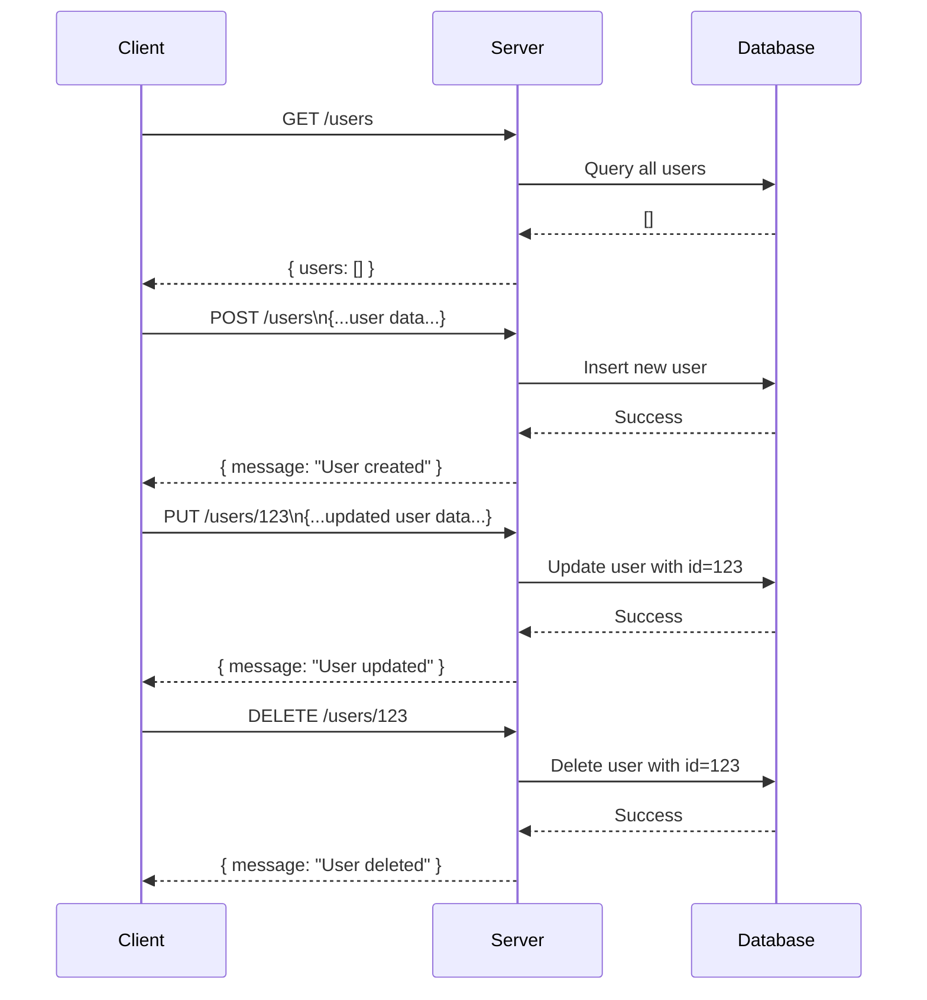

### Analysis of the provided backend code:

The code is an Express.js server implementation with several user-related API endpoints. There are no explicit authentication mechanisms visible (like middleware for auth).

---

## A) Clean API Endpoint List

| Endpoint     | HTTP Method | Path Parameters | Query Parameters | Request Body      | Response                      | Status Codes | Auth Required |
|--------------|-------------|-----------------|------------------|-------------------|-------------------------------|--------------|---------------|
| `/users`     | GET         | None            | None             | None              | `{ users: [] }`                | 200          | No            |
| `/users`     | POST        | None            | None             | None indicated *  | `{ message: "User created" }` | 200          | No            |
| `/users/:id` | PUT         | `id`            | None             | None indicated *  | `{ message: "User updated" }` | 200          | No            |
| `/users/:id` | DELETE      | `id`            | None             | None              | `{ message: "User deleted" }` | 200          | No            |

_* Request bodies are used logically for POST and PUT but no validation is implemented or example schema provided in the code._

---

## B) Short Developer Documentation

### User Management API

1. **GET /users**

   Retrieves a list of users.

   - Response (200): JSON object with an empty array of users `{ users: [] }`.
   - No authentication required.

2. **POST /users**

   Creates a new user.

   - Request Body: Expected to contain user creation details (not specified in code).
   - Response (200): `{ message: "User created" }`
   - No authentication required.

3. **PUT /users/:id**

   Updates user details for the specified user ID.

   - Path Parameter:
     - `id` (string): User's unique identifier.
   - Request Body: Expected to contain updated user data (not specified in code).
   - Response (200): `{ message: "User updated" }`
   - No authentication required.

4. **DELETE /users/:id**

   Deletes the specified user.

   - Path Parameter:
     - `id` (string): User's unique identifier.
   - Response (200): `{ message: "User deleted" }`
   - No authentication required.

---

## C) OpenAPI 3.0 YAML Specification

```yaml
openapi: 3.0.3
info:
  title: User Management API
  version: 1.0.0
paths:
  /users:
    get:
      summary: Retrieve list of users
      responses:
        '200':
          description: List of users
          content:
            application/json:
              schema:
                type: object
                properties:
                  users:
                    type: array
                    items:
                      type: object
    post:
      summary: Create a new user
      requestBody:
        required: false
        content:
          application/json:
            schema:
              type: object
              description: User creation data (schema not specified)
      responses:
        '200':
          description: User created confirmation
          content:
            application/json:
              schema:
                type: object
                properties:
                  message:
                    type: string
                    example: User created
  /users/{id}:
    put:
      summary: Update user by ID
      parameters:
        - in: path
          name: id
          required: true
          schema:
            type: string
          description: User ID
      requestBody:
        required: false
        content:
          application/json:
            schema:
              type: object
              description: User update data (schema not specified)
      responses:
        '200':
          description: User updated confirmation
          content:
            application/json:
              schema:
                type: object
                properties:
                  message:
                    type: string
                    example: User updated
    delete:
      summary: Delete user by ID
      parameters:
        - in: path
          name: id
          required: true
          schema:
            type: string
          description: User ID
      responses:
        '200':
          description: User deleted confirmation
          content:
            application/json:
              schema:
                type: object
                properties:
                  message:
                    type: string
                    example: User deleted
```

---

## D) Example Request and Response

### Example: PUT /users/123

**Request:**

```
PUT /users/123
Content-Type: application/json

{
  "name": "Alice",
  "email": "alice@example.com"
}
```

**Response:**

```json
{
  "message": "User updated"
}
```

---

## Mermaid Sequence Diagram



---

If you need further details or enhancements (e.g., adding request validation or authentication), please let me know!